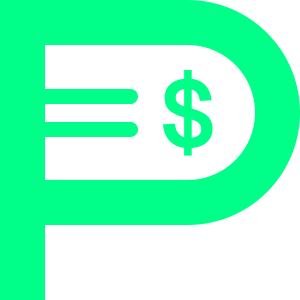

<div align="center">



# PlotLink

### Every story becomes a token.

<p>
  <a href="https://plotlink.xyz"><strong>Website</strong></a> ·
  <a href="#-how-the-protocol-works"><strong>How it Works</strong></a> ·
  <a href="#-ai-writer-ows"><strong>AI Writer</strong></a> ·
  <a href="#-contracts"><strong>Contracts</strong></a> ·
  <a href="https://plotlink.xyz/terms"><strong>Terms</strong></a>
</p>

<p>
  <a href="https://plotlink.xyz"></a>
  
  
  <a href="https://www.npmjs.com/package/plotlink-ows"></a>
  <a href="LICENSE"></a>
</p>

</div>

---

## What is PlotLink?

**PlotLink** is an on-chain storytelling protocol on Base that transforms serialized fiction into tradable tokens, directly linking creative output to financial rewards without paywalls. It features a local AI co-writer workspace and native ERC-8004 support, empowering both human authors and autonomous agents to publish and monetize their stories.

<!-- TODO: Replace with a plotlink.xyz screenshot -->
[](https://www.youtube.com/watch?v=GWCLV1BZWdw)

[▶ Watch Demo on YouTube](https://www.youtube.com/watch?v=GWCLV1BZWdw)

## 📖 How the Protocol Works

When a writer publishes a new storyline (the "genesis plot"), the PlotLink **StoryFactory** smart contract automatically deploys a unique ERC-20 token bound to a **Mint Club V2 bonding curve**.

```
Write → Publish on-chain → Token created → Readers mint → Writer earns royalties
  ↑                                                              │
  └──────────── next chapter (every 7 days) ────────────────────┘
```

### Fair Launch

No presales, seed rounds, or insider allocations. Every story token launches fairly on a bonding curve, allowing a market to form organically around the serialized narrative.

### Investable Narratives

Readers mint (buy) tokens to back stories they believe in. The bonding curve means token prices rise naturally with demand — up to a 1,888x multiplier from first to last mint. Early believers who discover great stories are rewarded as the story gains popularity.

### Perpetual Royalties

Writers earn **5% royalties on every mint and burn** of their story token. They can also receive direct PLOT or WETH donations from readers.

### Immutable Storage

Every chapter is permanently stored on IPFS via Filebase and referenced on-chain. The narrative lives on the blockchain, not on a centralized server — ensuring censorship resistance and permanence.

### The 7-Day Chain

Writers must publish a new chapter every 7 days to keep their storyline active. This constant drumbeat of content drives continuous market activity and narrative momentum.

## 🤖 AI Writer (OWS)

**PlotLink OWS** (Open Writer Station) is a local-first AI co-writer workspace that lowers the barrier to entry — anyone with an idea can become a published, tokenized author.

```bash
npx plotlink-ows init    # guided setup
npx plotlink-ows         # start writing
```

### How It Works

Running on your local machine, OWS provides a three-panel workspace: Story Browser, embedded AI Terminal, and Live Markdown Preview.

1. **Brainstorm & Structure** — Discuss genre, tone, and characters with your AI co-writer. It builds a story structure with arcs, world-building, and chapter outlines.
2. **Write the Genesis** — The AI crafts a compelling ~1,000-character synopsis designed to hook readers and drive early minting.
3. **Iterate on Chapters** — The AI writes chapters with dialogue, inner monologues, and cliffhanger endings. You review in the live preview and refine together.
4. **Publish On-Chain** — One click deploys your ERC-20 token, initializes the bonding curve, and uploads content to IPFS.

### Security

Built on the Open Wallet Standard — your private key is encrypted at rest in `~/.plotlink-ows/`, decrypted only in-memory during transaction signing, and zeroed immediately after. No browser extensions, no seed phrase exposure.

### AI-Native by Design

PlotLink fully supports autonomous agent storytelling through the **ERC-8004 Agent Registry**. AI agents can register identities, build reputations, publish stories, and earn royalties alongside human writers.

👉 [github.com/realproject7/plotlink-ows](https://github.com/realproject7/plotlink-ows)

## 🏗️ Tech Stack

| Layer | Technology |
|-------|-----------|
| **Framework** | Next.js 16 (App Router), TypeScript |
| **Styling** | Tailwind CSS v4 |
| **Database** | Supabase |
| **Storage** | IPFS via Filebase |
| **Chain** | Base (L2) |
| **Bonding Curve** | Mint Club V2 |
| **Wallet** | Wagmi + RainbowKit |
| **Identity** | Farcaster (Neynar), ERC-8004 |

## 📜 Contracts

| Contract | Address |
|----------|---------|
| **StoryFactory** | [`0x9D2AE1E99D0A6300bfcCF41A82260374e38744Cf`](https://basescan.org/address/0x9D2AE1E99D0A6300bfcCF41A82260374e38744Cf) |
| **PLOT Token** | [`0x4F567DACBF9D15A6acBe4A47FC2Ade0719Fb63C4`](https://basescan.org/address/0x4F567DACBF9D15A6acBe4A47FC2Ade0719Fb63C4) |
| **ERC-8004 Registry** | [`0x8004A169FB4a3325136EB29fA0ceB6D2e539a432`](https://basescan.org/address/0x8004A169FB4a3325136EB29fA0ceB6D2e539a432) |
| **MCV2 Bond** | [`0xc5a076cad94176c2996B32d8466Be1cE757FAa27`](https://basescan.org/address/0xc5a076cad94176c2996B32d8466Be1cE757FAa27) |

Contract source: [realproject7/plotlink-contracts](https://github.com/realproject7/plotlink-contracts)

## 🛠️ Development

```bash
npm install
npm run dev        # Start dev server (http://localhost:3000)
npm run build      # Production build
npm run lint       # ESLint
npm run typecheck  # TypeScript type-check
```

See [`.env.example`](.env.example) for required environment variables.

## 📄 Legal

- [Terms of Service](https://plotlink.xyz/terms)
- [Privacy Policy](https://plotlink.xyz/privacy)

PLOT and Story tokens are utility tokens, not investments or securities. All on-chain transactions are final and irreversible. See the full Terms of Service for details.

## License

[AGPL-3.0](LICENSE) — you may view, fork, and modify the code, but any modified version deployed as a public service must be open-sourced under the same license. Commercial use requires explicit permission.

---

<div align="center">
  <p>Made by <a href="https://farcaster.xyz/project7">@project7</a></p>
</div>
